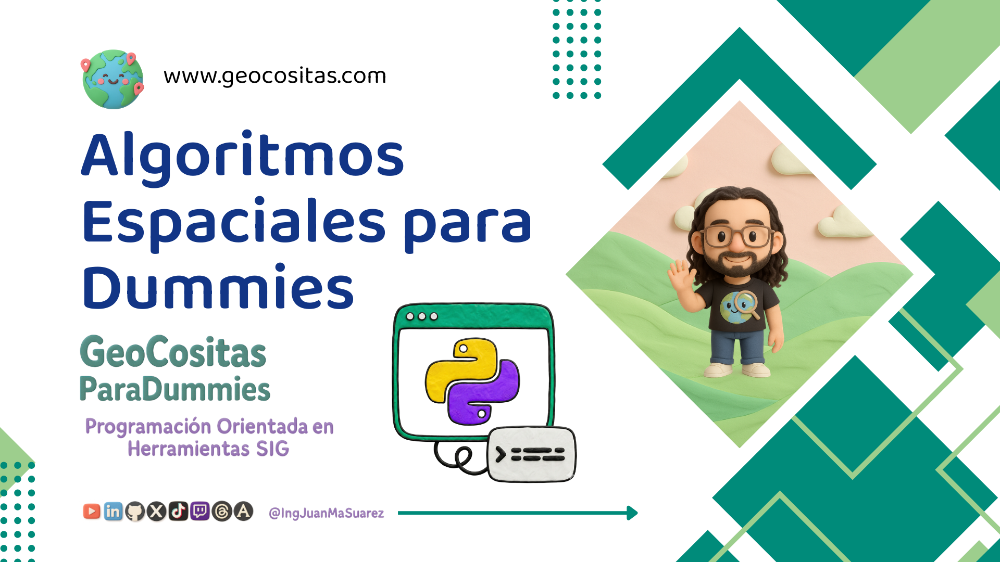

# Algoritmos-Espaciales-para-Dummies
Aprende como funcionan diferentes algoritmos espaciales. Usos, aplicaciones, explicación matemática y gráfica, seudocódigo y código en Python

## Clases en vídeo

### Curso de fundamentos desde cero

Curso que agrupa todas las clases que hacen referencia a los fundamentos de diferentes algoritmos espaciales.

> Código: Todo el código se encuentra en la raiz de este repositorio de Github

* [Lección 1 - Centro Medio o Mean Center](https://youtu.be/zryu1S_8h7E)

#### Puedes apoyar mi trabajo haciendo "☆ Star" en el repo o nominarme a "GitHub Star". ¡Gracias!

